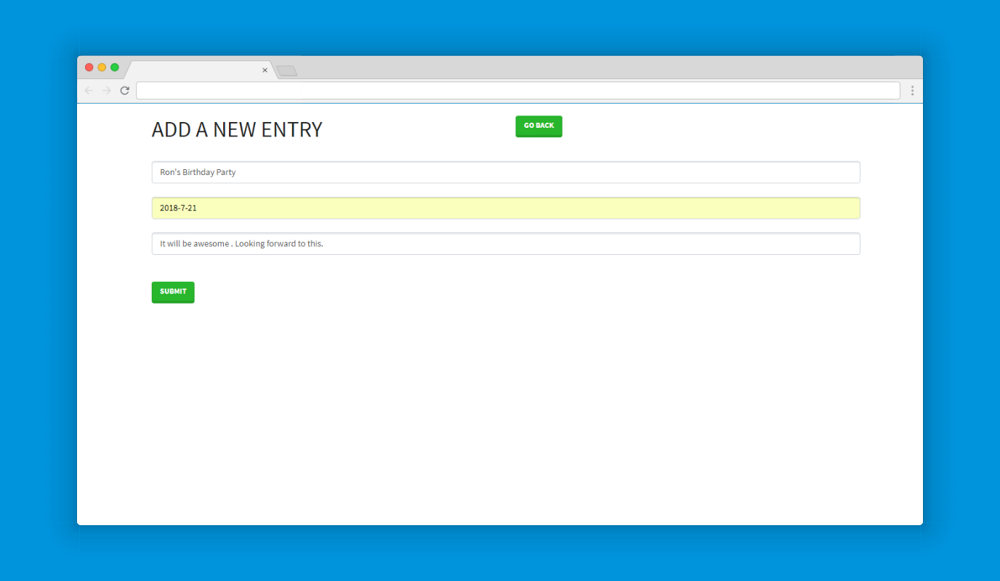

[](https://www.python.org/)

This is a calendar app inspired from `Django 2 Tutorial series` by The DumbFounds
--





To activate this environment, use

`conda activate calender`
    
To deactivate an active environment, use

`conda deactivate`

To run

```
cd django_calendar
pip install -r requirements.txt
cd calenderproject
chmod +x run.sh
./run.sh

```

